# Memory
>Memory คือ  อุปกรณ์เก็บสถานะของข้อมูลและชุดคำสั่ง เพื่อการประมวลผลของคอมพิวเตอร์ หน่วยความจำสามารถแบ่งออกได้เป็น 2 ประเภท คือหน่วยความจำถาวรกับหน่วยความจำชั่วคราว แต่ถ้าเราแบ่งตาม resource 
ตามการใช้งานของระบบเราสามารถแบ่งได้ 2 แบบคือ

* Physical Memory : คือหน่วยความจำหลักที่ติดตั้งอยู่ภายในเครื่องคอมพิวเตอร์ หรือที่เราเรียกว่า Random Access Memory (RAM) 
* Virtual Memory : เป็นหน่วยความจำเสมือนที่เอาไว้รองรับหาก RAM ความจุไม่เพียงพอหรือต้องการลดภาระของ RAM

โดย Virtual Memory จำเป็นต้องใช้ Physical Memory เพราะ Virtual Resource เป็นการแบ่ง 
Physical Resource มาแบ่งการใช้งาน แต่ Physical Memory ไม่จำเป็นต้องใช้ Virtual Memory
***

#### คำสั่งที่ใช้ในการจัดการหรือตรวจสอบหน่วยความจำของ linux มีคร่าวๆ ดังนี้

>1.free : คำสั่งนี้จะแสดงรายละเอียดเกี่ยวกับขนาด memory(RAM) และ swap(Virtual) ที่ถูกใช้ไปและที่เหลืออยู่ภายในระบบ โดยมีหน่วยเป็น kilobytes จะแสดงข้อมูลดังนี้

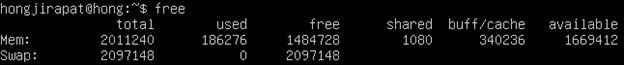

|ข้อมูลที่แสดง|ความหมาย|  
|:---:|:---:|
|total|memory/swap ทั้งหมดที่มี|
|used|memory/swap ทั้งหมดที่ใช้อยู่|
|free|memory/swap ทั้งหมดที่ว่างอยู่|
|shared|memory มาใช้แทน disk ทำให้ทำงานได้เร็ว|
|buff/cache|memory/swap ที่ใช้งานโดย buff/cache|
|available|เป็น memory ที่ว่างให้ใช้สำหรับการเริ่มใช้งาน Application โดยไม่ต้องใช้ swap memory|
---
>1.1 free -h : จะแสดงผลเหมือนกับ free แต่หน่วยของขนาดข้อมูลจะอยู่ในรูปแบบ human-readable หรือที่เรียกว่ามนุษย์เข้าใจได้

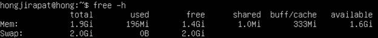

***
>2.vmstat(virtual memory statistics) : เป็นคำสั่งที่ใช้แสดงผลรายงานเกี่ยวกับสถิติการทำงานของ Virtual memory

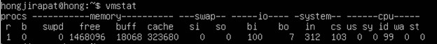

* Procs
    * r (running): จำนวนกระบวนการที่กำลังรอให้ CPU ประมวลผล
    * b (blocked): จำนวนกระบวนการที่รอให้ถูกเรียกใช้ถึงจะทำงานได้    
* Memory
    * swpd : จำนวน virtual memory ที่ถูกใช้ไป
    * free : จำนวน memory ที่ยังไม่ถูกใช้งาน
    * buff : จำนวน memory ที่ใช้งานโดย buffers
    * cache : จำนวน memory ที่ใช้งานโดย cache
* Swap
    * si (swap in) : จำนวนข้อมูลที่ถูกนำเข้ามาใน swap ที่มาจาก RAM
    * so (swap out) : จำนวนข้อมูลที่ถูกส่งออกจาก swap ไป RAM
* IO
    * Bi (blocks in) : จำนวนข้อมูลที่ถูกอ่านจาก block device
    * Bo (blocks out) : จำนวนข้อมูลที่ถูกส่งไปยัง block device
* System
    * In (interrupts) : จำนวนการเกิด interrupt ใน 1 วินาที
    * Cs (context switches) : จำนวนการเปลี่ยนสถานะของกระบวนการใน 1 วินาที
* CPU
    * us (user time) : เวลาที่ใช้ในการประมวลผลที่ไม่เกี่ยวข้องกับ kernal
    * sy (system time) : เวลาที่ใช้ประมวลผลงานที่เกี่ยวข้องกับ kernel
    * id (idle time) : เวลาว่างที่ CPU ไม่ทำงาน
    * wa (wait time) : เวลาที่ CPU ใช้รอ I/O
    * st (steal time) : เวลาที่ CPU ถูกขโมยจาก virtual machine
***
>2.1 vmstat -s : ใช้แสดงผลสถิติที่เกี่ยวข้องกับระบบทั้งหมด

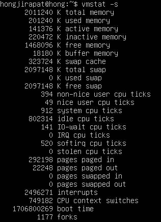

>2.2 vmstat -s | grep -i '.......' : ถ้าหากเราต้องการแค่บางข้อมูล เราสามารถใช้ คำสั่งนี้ได้ แล้วภายใน single quote(‘ ’) ให้ระบุข้อมูลที่เราต้องการสังเกต เช่น

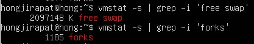

โดย grep ใช้สำหรับกรองและแสดงข้อมูล ส่วน -i ใช้เพื่อทำให้การค้นหาไม่ต้องพิจารณา case sensitive

>3.top : ใช้เพื่อตรวจสอบการใช้งานของ memory และ CPU ที่กำลังทำงานอยู่ขณะนั้นแบบ real-time โดยจะแสดงข้อมูลของระบบและรายชื่อของกระบวนการทำงานหรือ thread ที่ถูกจัดการโดย linux kernel ซึ่งประกอบไปด้วย

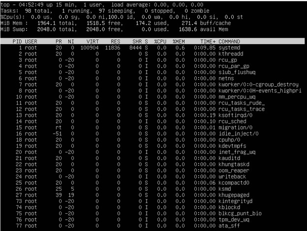

|ข้อมูลที่แสดง|ความหมาย|
|:---:|:---:|
|PID|แสดงรหัสลำดับของ task|
|PR|ลำดับความสำคัญของกระบวนการทำงาน ถ้าเลขยิ่งน้อยยิ่งสำคัญมาก|
|NI|เลขติดลบความสำคัญมาก เลขเป็นบวกความสำคัญจะน้อยกว่า|
|VIRT|ผลรวม virtual memory ที่ถูกใช้งาน|
|RES|แสดงการใช้งานของ RAM ขณะนั้น|
|SHR|แสดง shared memory size ที่ถูกใช้งาน|
|%CPU|แสดงการใช้งานของ CPU|
|%MEM|แสดงการใช้งานของ memory|
|TIME+|เวลาของ CPU แต่สะท้อนให้เห็นถึงรายละเอียดที่มากขึ้นตลอดเสี้ยววินาที|
|COMMAND|ชื่อของคำสั่งที่เริ่มกระบวนการทำงาน|
***

>4.htop : การใช้งานเหมือน top เพียงแค่มีฟีเจอร์มากกว่าตัว top เช่น รองรับการทำงานของ mouse มีสีเพื่อบ่งบอกข้อมูลที่ต่างกัน

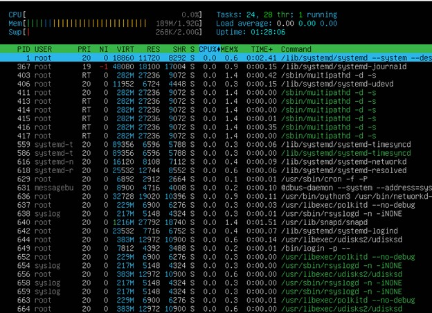

<h4 style="color:red">Tips : หากใช้คำสั่ง htop แล้วขึ้นว่า Command htop not found ให้ทำการพิมพ์คำสั่ง <em>sudo snap install htop</em></h4>

>5.lsmem: ใช้สำหรับแสดงข้อมูลเกี่ยวกับการใช้งานหน่วยความจำในระบบ รวมถึงข้อมูลเกี่ยวกับหน่วยความจำที่ระบบใช้งานอยู่

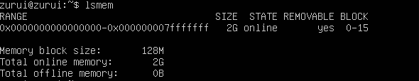

|ข้อมูลที่แสดง|ความหมาย|
|:---:|:---:|
|RANGE| แสดงช่วงของหน่วยความจำที่ระบบมีอยู่|
|SIZE| แสดงขนาดของหน่วยความจำในแต่ละช่วง|
|STATE| แสดงสถานะของหน่วยความจำ|
|REMOVABLE| แสดงว่าหน่วยความจำนั้นสามารถถอดออกได้หรือไม่|
|BLOCK| แสดงบล็อกที่เกี่ยวข้องกับแต่ละหน่วยความจำ|
***

>5.1 lsmem -h : จะแสดงคู่มือการใช้งานหรือคำสั่งช่วยเหลือ

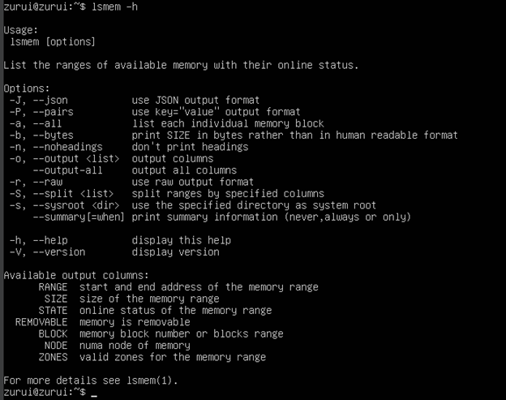

>5.2 lsmem -a: จะแสดงข้อมูลเกี่ยวกับหน่วยความจำทั้งหมดในระบบที่สามารถเข้าถึงได้ รวมถึงข้อมูลเกี่ยวกับสถานะและรายละเอียดของแต่ละหน่วยความจำ รวมถึงข้อมูลเพิ่มเติมที่ lsmem ไม่ได้แสดง

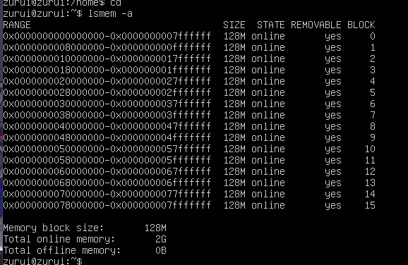

<h4 style="color:yellow">Note : lsmem กับ lsmem -a ตรงที่ lsmem -a จะแสดงจะแสดงข้อมูลเพิ่มเติมเกี่ยวกับหน่วยความจำทั้งหมด แต่ lsmem เหมือนเป็นแค่ภาพรวมที่ไม่ได้ลงลายละเอียด </h4>

>5.3 lsmem -b: แสดงขนาดของไบต์โดย ข้อมูลที่แสดงจะเป็นขนาดในหน่วยไบต์ทั้งหมดโดยตรง

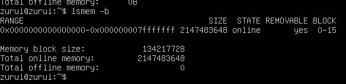

>5.4 lsmem -J: แสดงผลในรูปแบบของ JSON

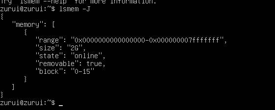

|ข้อมูลที่แสดง|ความหมาย|
|:---:|:---:|
|memories| ชื่อของชุดข้อมูลที่มีการแสดงข้อมูลของหน่วยความจำ|
|range| ช่วงของหน่วยความจำ|
|size| ขนาดของหน่วยความจำ|
|state| สถานะของหน่วยความจำ|
|removable| คือข้อมูลเกี่ยวกับความสามารถในการถอดออกได้ของหน่วยความจำ|
|block| แสดงบล็อกที่เกี่ยวข้องกับแต่ละหน่วยความจำ|
***

>5.5 lsmem -n: ไม่แสดงบรรทัดหัว

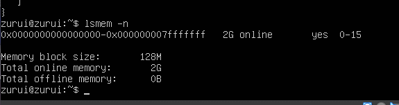

>5.6 lsmem -o: ระบุคอลัมน์ของผลลัพธ์ที่ต้องการแสดง ใช้ --help เพื่อรับรายการของคอลัมน์ที่รองรับทั้งหมด ใช้งานโดย + รายการที่อยากระบุคอลลัมน์ (e.g. lsmem -o +NODE)

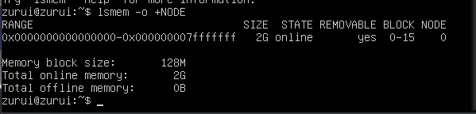

<h4 style="color:yellow">Note : lsmem --output-all จะแสดงคอลัมน์ทั้งหมดที่เป้นไปได้ </h4>

