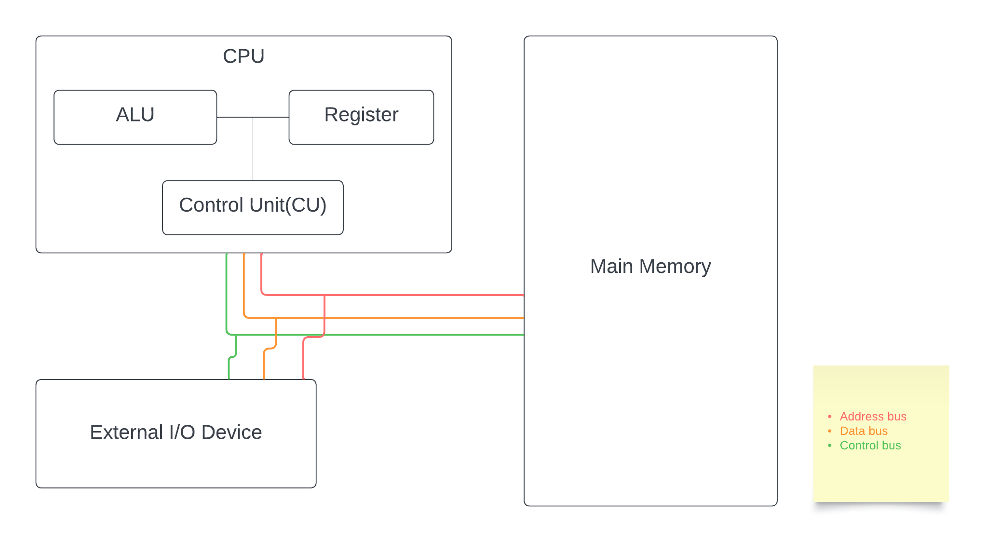

## Overview


### หน้าที่พื้นฐานของ I/O
- I/O ทำหน้าที่เคลื่อนย้ายข้อมูลระหว่างคอมพิวเตอร์ภายนอก
- Input คือการย้ายข้อมูลจากภายนอกเข้าสู่คอมพิวเตอร์
- Output คือการย้ายข้อมูลจากภายคอมพิวเตอร์เข้าสู่นอก

## อุปกรณ์ภายใน
CPU - ส่งข้อมูลโดยตรงไปยังRegisterผ่านbusภายในCPU
Mermory - ส่ง-รับข้อมูลระหว่างCPUสำหรับเก็บข้อมูลที่มีปริมาณมากขึ้นเกินกว่าRegisterจะรับได้ไหว

## อุปกรณ์ภายนอก
เป็นอุปกรณ์ต่างๆนอกเหนือComputer(CPU+Main Memory) เช่น Screen,printer,keyboard
หรือ เป็นพวกอุปกรณ์สำหรับสือสารด้วยก็ได้ (NIC)

การจัดการอุปกรณ์I/Oต่างๆจะดำเนินการผ่าน OS โดยผ่าน driver ที่ทำหน้าที่เป็น interface ให้ OS สามารถควบคุมอุปกรณ์เหล่านั้นได้

## I/O Modules
การที่จะให้อุปกรณ์I/Oต่างๆสามารถทำงานตามCPUซึ่งทำงานไว้มากๆๆจำเป็นจะต้องมีเทคนิคพิเศษมาช่วยรองรับการทำงานซึ่งการคือ การใช้วงจรพิเศษซึ่งก็คือ I/O นั้นเอง


### หน้าที่พื้นฐานของ I/O Modules
- ทำการควบคุมและtiming
- สื่อสารกับCPU และอุปกรณ์
- ทำ data buffering
- ทำการตรวจจับError

## ขั้นตอนการส่งข้อมูลของI/O
1. CPU ตรวจสถานะอุปกรณ์ I/O Module
2. I/O Module ตอบกลับสถานะ
3. ถ้าพร้อม CPU ก็จะขอส่งข้อมูล
4. I/O Module เอาข้อมูลจากอุปกรณ์
5. I/O Module ส่งข้อมูลไป CPU
6. ส่ง Output ในรูปแบบต่างๆ

## เทคนิคในการทำ I/O
### Programmed I/O
คือ การให้developerเขียนโปแกรมขึ้นมาเองสำหรับควบคุมการทำงานของ I/O

คุณลักษณะ
- CPU ควบคุม I/O โดยตรงเลย
- CPU ต้องรอ I/O Module ทำงานเสร็จ
- ใช้CPU Timeไปอย่างไร้ประโยชน์
- อาจมีปัญหาอย่างอื่นอีกหากเขียนโปรแกรมควบคุมได้ไม่ดี

### Interrupt I/O
คือ การใช้สัญญาณ interrupt เข้ามาช่วยในการทำงาน dev ไม่จำเป็นต้องเขียนโปรแกรมควบคุมเองเพราะ cpu มี I/O Interrput Service Routineให้ใช้อยู่ โดย I/O Module จะส่งสัญญาณ interrupt เมื่อพร้อมใช้งานแล้ว

คุณลักษณะ
- CPU ไม่ต้องมารอคอยเช็คสถานะ I/O Module
- ประหยัด CPU Timeขึ้น
## Direct Memory Access I/O (DMA)
 คือ การให้I/Oคุยกับ Main Memoryโดยตรงเลย ด้วยการเพิ่มชิ้นส่วน Hardware เข้าไปซึ่งชิ้นส่วนที่ว่าก็คือ DMA Controller

หลักการคือ CPU จะสั่งการทำงานด้านI/Oไปที่ DMA Controller แล้วไปทำงานอย่างอื่นเลย DMA Controller จะไปทำการรับ-ส่งข้อมูลระหว่างอุปกรณ์กับMain Memเมื่อทำงานเสร็ขแล้วจะส่ง InterruptไปหาCPU

คุณลักษณะ
- ต้องมีอุปกรณ์พิเศษ  = เพิ่ม cost
- ไม่เปลื้อง CPU Time
- ทำงานเร็ว

## Driver


Driver คือ โปรแกรมคอมพิวเตอร์ที่ทำหน้าที่เป็นตัวกลางในการสื่อสารระหว่าง OS กับอุปกรณ์ Hardware โดยไม่จำเป็นที่จะต้องรู้รายละเอียดของอุปกรณ์นั้นๆว่าทำงานอย่างไร


## Input/Output (I/O) redirection 
ในระบบปฏิบัติการ Linux คำว่าredirection หมายถึงความสามารถในการเปลี่ยนทิศทางของข้อมูลทั้งขาเข้า (stdin) และข้อมูลขาออก (stdout) ของคำสั่งที่รันบนเทอร์มินัล โดยปกติ ข้อมูลเข้ามาตรฐานจะเข้าผ่านแป้นพิมพ์ของคุณ ส่วนข้อมูลออกมาตรฐานจะแสดงบนหน้าจอของคุณ
ตัวอย่างเช่น คำสั่ง `cat < filename` จะอ่านเนื้อหาของไฟล์ filename เข้ามาแสดงบนหน้าจอ ผ่านทางข้อมูลเข้ามาตรฐาน (stdin) ซึ่งปกติก็คือแป้นพิมพ์ แต่เราสามารถเปลี่ยนเส้นทางของข้อมูลเข้าให้มาจากไฟล์แทน
ตัวอย่างการเปลี่ยนเส้นทางของข้อมูลออก: คำสั่ง `ls > output.txt` จะรันคำสั่ง `ls` เพื่อแสดงรายชื่อไฟล์ แต่แทนที่จะแสดงบนหน้าจอ ผลลัพธ์จะถูกบันทึกไปยังไฟล์ `output.txt` ผ่านทางข้อมูลออกมาตรฐาน (stdout)
การเปลี่ยนเส้นทางเป็นเครื่องมือที่มีประโยชน์มากในการควบคุมข้อมูลเข้าและออกของคำสั่งต่างๆ ในระบบ Linux

### Standard Streams ในการเปลี่ยนเส้นทางอินพุต-เอาต์พุต
เชลล์ bash ของ Linux มีท่อข้อมูลมาตรฐานสำหรับการเปลี่ยนเส้นทางอินพุต-เอาต์พุต 3 ท่อ ได้แก่ 
1) ข้อมูลเข้า (Stdin)
2) ข้อมูลออก (Stdout)  
3) ข้อมูลError (Stderr)
- ข้อมูลเข้า (Stdin): แทนด้วย stdin (0) เชลล์ bash รับข้อมูลจาก stdin โดยปกติข้อมูลจะมาจากแป้นพิมพ์
- ข้อมูลออก (Stdout): แทนด้วย stdout (1) เชลล์ bash ส่งข้อมูลไปยัง stdout ซึ่งโดยทั่วไปแสดงบนหน้าจอ 0, 1 และ 2 เรียกว่าตัวระบุไฟล์ (FD) 
## ตัวระบุไฟล์ (FD : File Descriptors)
ใน Linux ทุกอย่างคือไฟล์ ไดเร็กทอรี่ ไฟล์ทั่วไป และแม้แต่อุปกรณ์ก็ถือเป็นไฟล์ ไฟล์แต่ละไฟล์จะมีหมายเลขที่เกี่ยวข้อง หมายเลขนี้เรียกว่าตัวระบุไฟล์ (FD)
หน้าจอเทอร์มินัลของคุณก็มีตัวระบุไฟล์เช่นกัน เมื่อเรียกใช้โปรแกรม ผลลัพธ์จะถูกส่งไปยังตัวระบุไฟล์ของหน้าจอ จากนั้นคุณจะเห็นผลลัพธ์ของโปรแกรมบนหน้าจอแสดงผล หากส่งผลลัพธ์ของโปรแกรมไปยังตัวระบุไฟล์ของเครื่องพิมพ์ ผลลัพธ์จะถูกพิมพ์ออกมา
0, 1 และ 2 ใช้เป็นตัวระบุไฟล์สำหรับไฟล์ stdin, stdout และ stderr ตามลำดับ
## การเปลี่ยนเส้นทางข้อมูลเข้า (Redirection stdin)
เครื่องหมาย '<' ใช้สำหรับการเปลี่ยนเส้นทางข้อมูลเข้า (stdin) ตัวอย่างเช่น โปรแกรม mail ของ Linux ส่งอีเมลจากเทอร์มินัล Linux
คุณสามารถพิมพ์เนื้อหาอีเมลด้วยอุปกรณ์อินพุตมาตรฐาน (แป้นพิมพ์) อย่างไรก็ตาม หากคุณต้องการแนบไฟล์ไปกับอีเมล ให้ใช้คุณสมบัติการเปลี่ยนเส้นทางข้อมูลเข้าของ Linux รูปแบบการใช้ตัวดำเนินการเปลี่ยนเส้นทาง stdin คือ
```bash
Mail -s "Subject" to-address < Filename
```
:::note
คำสั่งนี้จะแนบไฟล์กับอีเมลของคุณ จากนั้นอีเมลจะถูกส่งไปยังผู้รับ
:::
## การเปลี่ยนเส้นทางข้อมูลออก (Redirection stdout)
เครื่องหมาย '>' หมายถึงการเปลี่ยนเส้นทางข้อมูลออก ตัวอย่างด้านล่างจะช่วยให้คุณเข้าใจฟังก์ชันของมัน
```bash
ls -al > listings
```
:::note
ในตัวอย่างข้างต้น คำสั่งส่งออก ls-al จะถูกเปลี่ยนเส้นทางไปยังไฟล์ "listings" และจะไม่ไปที่หน้าจอของคุณ
:::

:::danger[หมายเหตุ]
 หากมีไฟล์ที่มีชื่อเดียวกันอยู่แล้ว คำสั่งข้างต้นจะลบเนื้อหาของไฟล์นั้นและเขียนทับไป หากคุณไม่ต้องการให้ไฟล์ถูกเขียนทับและต้องการเพิ่มเนื้อหาลงในไฟล์ที่มีอยู่ ให้ใช้operator จาก `>` เป็น `>>` แทน
:::
``` bash
cat music.mp3 > /dev/audio
```
:::note
ในตัวอย่างข้างต้น คำสั่ง cat ใช้เพื่ออ่านไฟล์ music.mp3 ส่งผลลัพธ์ไปยังอุปกรณ์เสียง /dev/audio หากคุณมีการกำหนดอุปกรณ์เสียงที่ถูกต้องบนคอมพิวเตอร์ คำสั่งข้างต้นจะเล่นไฟล์เพลง music.mp3
:::
## เปลี่ยนเส้นทางข้อมูลผิดพลาด (Redirection stderr)
การเปลี่ยนเส้นทางข้อมูลผิดพลาดเป็นคุณสมบัติยอดนิยมใน Linux หลายครั้งที่คุณพบข้อผิดพลาดจำนวนมากขณะรันโค้ด การเปลี่ยนเส้นทางข้อมูลผิดพลาดหมายถึงการส่งข้อผิดพลาดเหล่านั้นไปยังไฟล์เฉพาะแทนที่จะแสดงบนหน้าจอ ตามค่าเริ่มต้น สตรีมข้อมูลผิดพลาดจะแสดงบนหน้าจอของคุณ
เมื่อคุณค้นหาไฟล์ คุณมักจะพบข้อผิดพลาด "permission denied" ข้อผิดพลาดเหล่านี้ไม่ได้ช่วยในการค้นหาของคุณ เมื่อเรียกใช้สคริปต์เชลล์ จะไม่ต้องการดูข้อความแสดงข้อผิดพลาดที่ทำให้ผลลัพธ์ปกติดูยุ่งยาก การเปลี่ยนเส้นทางข้อผิดพลาดเหล่านี้จึงเป็นวิธีแก้ไข

```bash
myprogram 2>errorsfile
```

:::note
ในตัวอย่างข้างต้น โปรแกรมชื่อ "myprogram" จะถูกรัน "2>" จะเปลี่ยนเส้นทางเอาต์พุตข้อผิดพลาดไปยังไฟล์ที่ระบุชื่อ "errorfile" ดังนั้นเอาต์พุตของโปรแกรมจึงไม่เกะกะด้วยข้อผิดพลาด 
:::

## อุปกรณ์I/O
อุปกรณ์Input คือ อุปกรณ์ที่ใช้ส่งสัญญาณไปยังคอมพิวเตอร์เพื่อทำงานต่างๆ สัญญาณเหล่านี้จะถูกส่งไปยังหน่วยประมวลผลกลาง (CPU) ซึ่งทำหน้าที่ส่งสัญญาณไปยังอุปกรณ์เอาต์พุตต่อไป
อุปกรณ์Output คือ อุปกรณ์ที่แสดงผลลัพธ์ให้เราเห็นหลังจากป้อนข้อมูลเข้าไปในระบบคอมพิวเตอร์ ผลลัพธ์นั้นสามารถแสดงออกมาในรูปแบบต่างๆ มากมาย เช่น ภาพ กราฟิก เสียง วิดีโอ เป็นต้น
:::note
เมื่อเราต้องการทราบว่า os รู้จักอุปกรณ์ใดบ้างจะใช้คำสั่งดั่งนี้
```bash
lshw 
```

:::
### คียบอร์ด
เป็นอุปกรณ์ Input Hardware ที่ใช้สำหรับป้อนข้อมูลเข้าสู่คอมพิวเตอร์ โดยปกติจะใช้สำหรับป้อนตัวอักษร, ตัวเลข, สัญลักษณ์, และคำสั่งต่างๆ โดยใช้การกดปุ่มต่างๆ บนพื้นผิวของคีย์บอร์ด
คีย์บอร์ดที่ใช้กันอยู่ในปัจจุบันมักมีโครงสร้างเป็นแถบๆ ที่ประกอบด้วยปุ่มต่างๆ โดยแต่ละปุ่มจะมีฟังก์ชันที่แตกต่างกัน อาจเป็นตัวอักษร, ตัวเลข, สัญลักษณ์พิเศษ, หรือคำสั่งเฉพาะ เช่น ลบ, ย้ายเคอร์เซอร์, หรือคีย์แบบพิเศษอื่นๆ
ระบบการเชื่อมต่อของคีย์บอร์ดส่วนใหญ่จะเป็นแบบไร้สาย (Wireless) หรือแบบใช้สาย (Wired) โดยทั่วไปจะใช้เทคโนโลยี USB (Universal Serial Bus) เพื่อเชื่อมต่อกับคอมพิวเตอร์หรืออุปกรณ์อื่นๆ อีกทั้งยังมีระบบการเชื่อมต่อแบบ Bluetooth ใช้งานได้กับอุปกรณ์พกพาแบบโทรศัพท์มือถือและแท็บเล็ตอีกด้วย
ประเภทของปุ่มบนคีบอร์ด
- Numeric Keys เป็นปุ่มที่จะป้อนข้อมูลตัวเลข
- Typing Keys เป็นปุ่มตัวอักษร A-Z และตัวเลข 0-9
- Control Keys เป็นปุ่มควบคุมต่างๆ เช่น ปุ่มลูกศร 4 ทิศ, Ctrl, Alt, Escape, Home, End, Insert เป็นต้น
- Special Keys เป็นปุ่มฟังก์ชันพิเศษต่างๆ เช่น ปุ่ม Enter, Shift, Num Lock, Caps Lock, Print Screen เป็นต้น
- Function Keys เป็นปุ่มฟังก์ชันมี 12 ตัว คือ F1-F12

### เมาส์
เป็นอุปกรณ์ Input Hardware ที่ใช้สำหรับควบคุมตำแหน่งของเคอร์เซอร์บนหน้าจอคอมพิวเตอร์ โดยการเคลื่อนที่เมาส์บนพื้นผิวเกี่ยวของโต๊ะหรือพื้นผิวที่เหมาะสม จะทำให้เคอร์เซอร์บนหน้าจอเคลื่อนที่ตามไปด้วย และการกดปุ่มบนเมาส์จะทำงานเป็นการส่งสัญญาณไปยังคอมพิวเตอร์เพื่อปฏิบัติการต่างๆ ซึ่งอาจเป็นการเลือก, คลิก, และซูมเข้าหรือซูมออก ตามโปรแกรมหรือแอปพลิเคชันที่ใช้งานอยู่
เมาส์มักจะมีปุ่มคลิกซ้ายและขวา โดยปุ่มคลิกซ้ายใช้สำหรับการคลิกเลือก และปุ่มคลิกขวาใช้สำหรับการเรียกเมนูหรือฟังก์ชันพิเศษต่างๆ นอกจากนี้ ยังมีล้อเลื่อน (scroll wheel) ที่มักจะอยู่ระหว่างปุ่มคลิกซ้ายและปุ่มคลิกขวา ที่ใช้สำหรับเลื่อนเนื้อหาบนหน้าจอขึ้นลงหรือด้านข้าง
เมาส์มักใช้กับคอมพิวเตอร์เดสก์ท็อปและโน้ตบุ๊ก รวมถึงอุปกรณ์ที่ใช้งานเกี่ยวกับการเล่นเกม และงานที่ต้องการความแม่นยำในการควบคุมตำแหน่ง เช่น งานกราฟิกและการออกแบบ

### Webcam 
เป็นอุปกรณ์ Input Hardware ที่ใช้ในการถ่ายภาพหรือวิดีโอโดยใช้กล้องดิจิตอลที่ติดตั้งอยู่บนเครื่องคอมพิวเตอร์หรืออุปกรณ์อื่นๆ เพื่อสร้างภาพหรือวิดีโอสดๆ หรือเก็บไว้เพื่อใช้งานภายหลังได้
การใช้งานกล้องเว็บแคมทำให้ผู้ใช้สามารถทำงานหรือสื่อสารระยะไกลผ่านเครือข่ายอินเทอร์เน็ตได้ โดยเฉพาะในการทำงานที่ต้องการการสื่อสารแบบภาพหรือวิดีโอ เช่น การทำงานระยะไกลผ่านวิดีโอคอล การสนทนาหรือการประชุมออนไลน์ เป็นต้น

### ไมโครโฟน 
เป็นอุปกรณ์ Input Hardware ที่ใช้ในการรับเสียงและแปลงเสียงเป็นสัญญาณไฟฟ้า เพื่อส่งข้อมูลเสียงเข้าสู่คอมพิวเตอร์ หรืออุปกรณ์อื่นๆ สำหรับการบันทึกเสียงหรือใช้ในการสื่อสารระยะไกลผ่านเครือข่ายอินเทอร์เน็ต หรือแม้แต่การทำงานกับแอปพลิเคชันที่ต้องการเสียงอินพุต เช่น แอปพลิเคชันเสียงระบบ (Voice over IP) หรือ แอปพลิเคชันเพลง เป็นต้น
ไมโครโฟนทำงานโดยรับเสียงจากผู้ใช้หรือสิ่งแวดล้อม จากนั้นจะแปลงเสียงดังกล่าวเป็นสัญญาณไฟฟ้าซึ่งจะถูกส่งไปยังอุปกรณ์ตัวรับ เช่น คอมพิวเตอร์ โทรศัพท์มือถือ หรืออุปกรณ์อื่นๆ ที่รองรับการรับเสียง เพื่อประมวลผลหรือเพื่อส่งต่อไปยังแอปพลิเคชันที่ต้องการใช้งานเสียงนั้นๆ
ไมโครโฟนมีความสำคัญในการทำงานหรือสื่อสารในรูปแบบเสียง และมักนำมาใช้ในการประชุมออนไลน์, การสนทนาผ่านโทรศัพท์แบบไอพี (IP phone), การบันทึกเสียง, การพูดคุยในเกมออนไลน์, หรือแม้แต่ในการสร้างเสียงเพลงและอัดเสียง

### จอภาพ
เป็นอุปกรณ์ Output Hardware ที่ใช้แสดงผลข้อมูลที่ถูกประมวลผลมาจากระบบคอมพิวเตอร์หรืออุปกรณ์อื่นๆ โดยปกติจะใช้ในการแสดงผลภาพและข้อความบนหน้าจอสำหรับผู้ใช้เห็น
จอภาพมีลักษณะที่แตกต่างกันไปตามการใช้งานและความต้องการ รวมถึงขนาดของหน้าจอ ความละเอียดของภาพ ความสามารถในการแสดงสี และอื่นๆ
การเชื่อมต่อระหว่างระบบคอมพิวเตอร์กับจอภาพสามารถทำได้ผ่านหลายวิธี เช่น การใช้สาย VGA, HDMI, DisplayPort, หรือแม้แต่การเชื่อมต่อไร้สายแบบ Wi-Fi ในบางกรณี
หน้าจอสามารถใช้ในหลายรูปแบบขึ้นอยู่กับการใช้งาน เช่น จอแสดงผลแบบโทรทัศน์ (TV screen), จอคอมพิวเตอร์แบบโทรทัศน์ (Computer Monitor), จอแสดงผลแบบโปรเจ็กเตอร์ (Projector screen), หรือแม้แต่จอแสดงผลบนอุปกรณ์พกพา เช่น สมาร์ทโฟน, แท็บเล็ต

### ลำโพง
เป็นอุปกรณ์ Output Hardware ที่ใช้แปลงสัญญาณไฟฟ้าเป็นเสียงเสียบนอุปกรณ์เครื่องเสียง เพื่อสร้างเสียงของเพลง, คำพูด, หรือเสียงอื่นๆ ให้ผู้ใช้ได้ยิน
ลำโพงมักถูกใช้ในหลายแง่มุมต่างๆ เช่น ในระบบเสียงบ้าน, ระบบเสียงในรถยนต์, ระบบเสียงในคอมพิวเตอร์, หรือแม้แต่ในระบบประกาศสาธารณะ เป็นต้น
ลำโพงมีความหลากหลายในขนาด, รูปแบบ, และลักษณะเสียง ซึ่งมีผลต่อประสบการณ์การฟัง เช่น ลำโพงที่มีขนาดใหญ่และมีกำลังเสียงสูงสามารถให้เสียงดังและมีความลึกมากขึ้น ในขณะที่ลำโพงที่มีขนาดเล็กสามารถนำพาไปใช้งานได้ทุกที่ และมักมีความสามารถในการถ่ายทอดเสียงที่เป็นคุณภาพได้ดี
ในการเชื่อมต่อลำโพงกับอุปกรณ์เครื่องเสียงหรืออุปกรณ์อื่นๆ มักใช้สายเคเบิลหรือการเชื่อมต่อไร้สาย เช่น Bluetooth

### NIC (Network Interface Card)
เป็นอุปกรณ์ Output Hardware ที่ใช้ในการเชื่อมต่อคอมพิวเตอร์หรืออุปกรณ์อื่นๆ เข้าสู่เครือข่ายคอมพิวเตอร์ เพื่อรับและส่งข้อมูลไปยังเครือข่ายอื่น ๆ อาทิเช่น เครือข่าย LAN (Local Area Network) หรือเครือข่ายอินเทอร์เน็ต นอกจากนี้ NIC ยังสามารถใช้ในการเชื่อมต่อกับอุปกรณ์เสริมอื่น ๆ ที่ต้องการการสื่อสารผ่านเครือข่าย เช่น เครื่องพิมพ์เครือข่าย (Network Printers) หรือเครื่องเก็บข้อมูลเครือข่าย (Network Storage Devices)
NIC มักประกอบด้วยพอร์ตเครือข่ายที่ใช้สาย Ethernet (LAN) สำหรับเชื่อมต่อกับสายเครือข่าย เครื่องซอฟต์แวร์บนคอมพิวเตอร์สามารถใช้ NIC เพื่อส่งและรับข้อมูลผ่านเครือข่ายได้ โดยในปัจจุบัน NIC มักมีความเร็วสูงสุดในการรับและส่งข้อมูลที่เทียบเท่ากับความเร็วของเครือข่ายที่ใช้งานอยู่ เช่น NIC ที่รองรับ Gigabit Ethernet สามารถรับส่งข้อมูลได้ที่ความเร็ว 1 Gigabit ต่อวินาที
นอกจากนี้ NIC ยังมีหลายรูปแบบและมาตรฐานที่ต่างกัน รวมถึงการเชื่อมต่อผ่านพอร์ตต่าง ๆ เช่น PCI, PCI Express, USB, และ Wi-Fi (สำหรับเครื่องซอฟต์แวร์ที่รองรับการเชื่อมต่อ Wi-Fi)
### USB Drive
USB Drive (หรือ Flash Drive) เป็นอุปกรณ์ Input และ Output Hardware ที่ทำหน้าที่เก็บข้อมูลแบบพกพา โดยมักจะมีขนาดเล็กพอที่จะสามารถนำพกไปใช้งานได้ง่ายในที่ต่าง ๆ ซึ่ง USB Drive สามารถใช้งานในฐานะทั้ง Input และ Output Hardware ได้ดังนี้
เมื่อเชื่อมต่อ USB Drive เข้ากับคอมพิวเตอร์หรืออุปกรณ์อื่นที่รองรับ USB Port, USB Drive
ในฐานะ Input จะสามารถใช้เพื่อรับข้อมูลจากอุปกรณ์หรือคอมพิวเตอร์นั้น ๆ โดยอาจเป็นไฟล์ต่าง ๆ เช่น เอกสาร, รูปภาพ, วิดีโอ, เพลง, และข้อมูลอื่น ๆ ที่ต้องการเก็บไว้ใน USB Drive
ในฐานะ Output จะสามารถอ่านข้อมูลที่อยู่ใน USB Drive และนำมาใช้งานได้ หรือจะสามารถเขียนข้อมูลลงใน USB Drive ได้โดยที่ USB Drive นั้นจะทำหน้าที่เป็น Output Hardware ในการส่งข้อมูลที่อยู่ใน USB Drive ไปยังอุปกรณ์หรือคอมพิวเตอร์ที่เชื่อมต่ออยู่กับ USB Drive นั้น
CD and DVD
เป็นสื่อบันทึกข้อมูลแบบอะนาล็อกซ์ (optical disc) เป็นอุปกรณ์ Input และ Output Hardware  ที่ใช้เก็บข้อมูลและสื่อต่าง ๆ อย่างเช่น เพลง, ภาพยนตร์, ข้อมูลคอมพิวเตอร์, และโปรแกรมต่าง ๆ ซึ่งสามารถใช้งานในฐานะทั้ง Input และ Output Hardware ได้ดังนี้
ในการอ่านข้อมูลจาก CD หรือ DVD, อุปกรณ์อ่านแบบไฟฟ้าจะใช้เลเซอร์เพื่ออ่านข้อมูลที่ถูกบันทึกไว้บนแผ่นออกมา เมื่อแผ่นถูกวางในอุปกรณ์อ่าน 
ในฐานะ Input จะสามารถรับข้อมูลต่าง ๆ จากแผ่น CD หรือ DVD และส่งข้อมูลนั้นไปยังคอมพิวเตอร์หรืออุปกรณ์อื่นที่เชื่อมต่อกับอุปกรณ์อ่านได้ เช่น เพลย์เออร์ซีดี, ไดร์ฟออปติก, หรือเครื่องเล่น DVD
ในฐานะ Output จะสามารถส่งข้อมูลที่ถูกอ่านจาก CD หรือ DVD ออกไปยังอุปกรณ์อื่น ๆ เพื่อการแสดงผลหรือการนำไปใช้งานต่อได้ เช่น เสียงที่ถูกอ่านจากแผ่น CD สามารถถูกส่งไปยังลำโพงเพื่อเล่นเพลง, ภาพหรือวิดีโอที่ถูกอ่านจากแผ่น DVD สามารถถูกส่งไปยังหน้าจอโทรทัศน์หรือจอคอมพิวเตอร์เพื่อการแสดงภาพหรือวิดีโอ เป็นต้น
## Modem
เป็นอุปกรณ์ Input และ Output Hardware ที่ใช้ในการแปลงสัญญาณดิจิตอลเป็นสัญญาณอนาล็อกซ์ (และกลับกัน) เพื่อให้เครือข่ายคอมพิวเตอร์สามารถสื่อสารกับอุปกรณ์อื่นๆ ในเครือข่ายได้ ซึ่ง Modem สามารถใช้งานในฐานะทั้ง Input และ Output Hardware ได้ดังนี้
ในฐานะ Input เมื่อรับสัญญาณดิจิตอลจากอุปกรณ์อื่น ๆ ที่ต้องการเชื่อมต่อกับเครือข่าย เช่น การรับสัญญาณอินเทอร์เน็ตจากผู้ให้บริการอินเทอร์เน็ต (ISP) ผ่านเสาอากาศ (สำหรับการเชื่อมต่อแบบไร้สาย) หรือจากสายโทรศัพท์ (สำหรับการเชื่อมต่อแบบ DSL) โดย Modem จะรับสัญญาณดิจิตอลเหล่านั้นและแปลงเป็นสัญญาณอนาล็อกซ์ที่สามารถใช้งานได้กับอุปกรณ์คอมพิวเตอร์
ในฐานะ Output เมื่อส่งสัญญาณอนาล็อกซ์ออกไปยังเครือข่ายหรืออุปกรณ์อื่น ๆ โดย Modem ส่วนใหญ่ใช้งานเพื่อส่งสัญญาณอินเทอร์เน็ต แต่ก็สามารถใช้ส่งข้อมูลอื่น ๆ ได้ เช่น การส่งสัญญาณโทรศัพท์แบบดิจิตอลผ่านสายโทรศัพท์ (ในกรณีของ DSL) หรือการส่งสัญญาณให้กับเสาอากาศ (สำหรับการเชื่อมต่อแบบไร้สาย) เพื่อส่งข้อมูลไปยัง ISP หรือเครือข่ายอื่น ๆ
