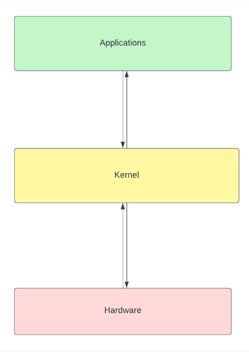
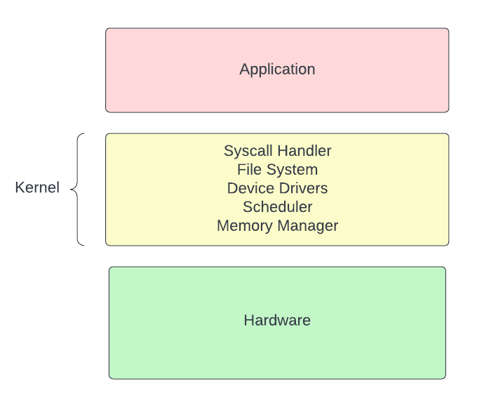

# Kernel

### Kernel คือ อะไร ?
>ระบบปฏิบัติการที่มีหน้าที่จัดการทรัพยากรของระบบและจัดการกับการประมวลผล โดยจะเป็นตัวกลางที่มีหน้าที่ติดต่อระหว่าง Software กับ Hardware
  

### หน้าที่ของ Kernel
>Kernel มีหน้าที่เป็นส่วนช่วยติดต่อสื่อสารระหว่างแอปพลิเคชั่นและฮาร์ดแวร์แบบ low-level services มีอยู่ 4 อย่างได้แก่

1. การจัดการการใช้งานหน่วยความจำ คอยติดตามปริมาณการการใช้หน่วยความจำ สิ่งที่ถูกจัดเก็บในหน่วยความจำ และที่อยู่ในหน่วยความจำ
2. การจัดการ process พิจารณาว่ากระบวนการใดบ้างที่สามารถใช้หน่วยประมวลผลกลาง (CPU) ได้  ใช้งานเมื่อไหร่ และใช้นานเพียงใด
3. การจัดการไดรเวอร์ของอุปกรณ์ ทำหน้าที่เป็นสื่อกลาง/ล่ามระหว่างฮาร์ดแวร์และ process ต่างๆ
4. การจัดการคำสั่งเรียกใช้ระบบและความปลอดภัย รับคำขอบริการจาก process ต่างๆ

### ประเภทของ Kernel

1. Microkernel: เป็นสถาปัตยกรรมของระบบปฏิบัติการที่ kernel จะถูกทำให้มีขนาดเล็กที่สุดเท่าที่เป็นไปได้ โดยมีแค่ส่วนพื้นฐานที่จำเป็นต่อของระบบปฏิบัติการเท่านั้น

1. Monolithic kernel: เป็นสถาปัตยกรรมของระบบปฏิบัติการที่ทำในรูปแบบรวม ไดรเวอร์ของอุปกรณ์ ระบบไฟล์ และคำสั่งเรียกใช้ระบบมาในตัวของ Kernel เลย

(img)

3. Hybrid kernel: เป็นระบบปฏิบัติการที่รวมเอา Microkernel และ Monolithic kernel เข้าด้วยกัน เพื่อที่จะเอาข้อดีของทั้งสอง kernel มากลบข้อเสียซึ่งกันและกัน

(img)

4. Exokernel: เป็นสถาปัตยกรรมของระบบปฏิบัติการที่เน้นให้มี abstraction ในระบบให้น้อยที่สุด เสมือนเราไปควบคุมทรัพยากรของอุปกรณ์ต่างๆโดยตรง

(img)

5. Nanokernel: เป็นสถาปัตยกรรมของระบบปฏิบัติการที่ที่คล้ายกับ Microkernel แต่มีขนาดที่เล็กกว่าและทำให้มีประสิทธิภาพมากกว่าเมื่อเทียบกัน

(img)

### คำสั่ง linux ที่เกี่ยวข้องกับ Kernel

 <h4 style="text-align: center;"><strong>lsmod [module name]</strong></h4>

lsmod เป็น tool ที่อนุญาตให้แสดงรายการโมดูลใน Linux Kernel 

ผลลัพธ์ เมื่อใช้ lsmod

(img)

ซ้ายสุด = module  กลางซ้าย = size กลางขวา = used ขวา =  by

<h4 style="text-align: center;"><strong>insmod [file name] [module-options...]</strong></h4>

insmod เป็นคำสั่งที่ใช้แทรกโมดูลเข้าไปใน Kernel ในรูปแบบ kernel object file ไฟล์ .ko

<h4 style="text-align: center;"><strong>rmmod [-f] [-s] [-v] [modulename]</strong></h4>

rmmod เป็นคำสั่งที่ใช้เพื่อลบโมดูลที่เราไม่ต้องการออก

<h4 style="text-align: center;"><strong>depmod [options] [kernel_version]</strong></h4>

depmod เป็นคำสั่งที่เพื่อสร้างหรืออัปเดตไฟล์ modules.dep, modules.dep.bin และ map file ซึ่งเป็นข้อมูลที่ใช้ modprobe เพื่อจัดการ kernel modules

ผลลัพธ์ เมื่อใช้ depmod

(img)

(img)

<h4 style="text-align: center;"><strong>modinfo module_name</strong></h4>

modinfo เป็นคำสั่งที่แสดงข้อมูลของโมดูลนั้นๆ

ผลลัพธ์ เมื่อใช้ modinfo

(img)

(img)

<h4 style="text-align: center;"><strong>systool -v -m module_name</strong></h4>

systool เป็นคำสั่งที่ดูข้อมูลอุปกรณ์ที่มีการเชื่อมต่อกับระบบ และ kernel modules

ผลลัพธ์ เมื่อใช้ systool

(img)

<h4 style="text-align: center;"><strong>modprobe [options] [module_name]
ผลลัพธ์เมื่อใช้ modprode 
</strong></h4>

modprobe: ใช้ในการเพิ่ม หรือ ลบ kernel modules

(img)

(img)

